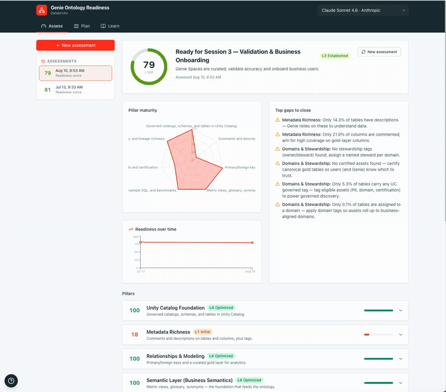
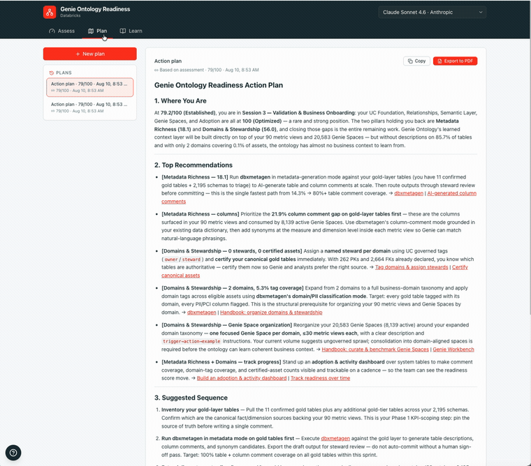
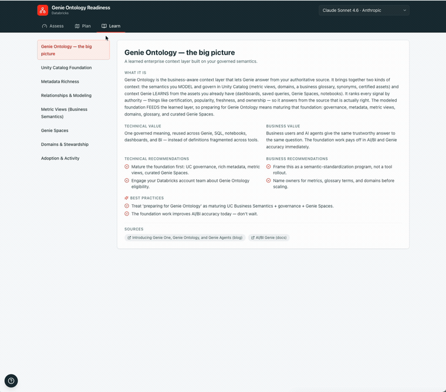

# Genie Ontology Readiness

A self-contained Databricks App that helps a customer **prepare for Genie Ontology**.
Deploy it into a workspace and it will:

- **Assess** the live environment and score maturity across the readiness pillars
  Genie Ontology depends on (Unity Catalog, metadata, relationships, metric views /
  Business Semantics, Genie Spaces, domains, adoption).
- **Explain** each capability from a **technical** and a **business** standpoint, with
  accurate GA / preview status.
- **Recommend** best practices for both technical enablement and business adoption.
- **Generate** a tailored, sequenced enablement + adoption plan and answer questions
  via an AI assistant — powered by the customer's **own Foundation Model API**.

The assessment is **read-only** and degrades gracefully when a signal isn't available.

> Genie Ontology is the *learned* enterprise context layer (gated preview) built on the
> customer's *governed* UC Business Semantics foundation (largely GA). Preparing for it =
> maturing that foundation. See `CLAUDE.md` for the product framing and full deploy steps.

## Walkthrough

The app has three tabs. Each walkthrough below is a short, sped-up screen capture.

### Assess — the 7-pillar readiness scorecard

Run a read-only assessment that scores your workspace across seven pillars, rolls up to a
0–100 readiness score and maturity stage, and expands each pillar to its signals and gaps.



### Plan — a tailored action plan

Generate a prioritized, tactical action plan from a saved assessment — grounded in your real
scores and gaps and powered by your workspace's own Foundation Model API.



### Learn — enablement and accelerators

Explore each capability from a technical and a business angle, with best practices, downloadable
guides, and the public Databricks accelerators that raise each pillar's score.



## Quick start

```bash
cd app/frontend && npm install && npm run build && cd ../..
databricks bundle deploy -t dev --profile <p> --var="warehouse_id=<id>"
DATABRICKS_PROFILE=<p> WAREHOUSE_ID=<id> python3 scripts/post_deploy.py
```

See **[CLAUDE.md](./CLAUDE.md)** for prerequisites, the service-principal grants the
assessment needs, local development, optional Lakebase history, and branding.

## Permissions required

The app reads only **metadata** (`information_schema`, tags) and **system tables**
(`system.access.*`, `system.query.*`) — never your actual table data. It can run two
ways, and **every signal uses the same identity**:

- **Interactive** — a person viewing the app. With **on-behalf-of-user (OBO)**
  authorization enabled, **all reads run as the viewing user** (their own Unity
  Catalog + system-table grants), so the app SP does not need any grants. The
  assessment reflects exactly what *you* can see.
- **Scheduled / unattended** — snapshot history or any background run with no user
  present (also local dev). Every read falls back to the app **service principal
  (SP)**, so the SP must hold the grants below.

### Who needs what

| Assessment area | Reads from | Grant needed (held by the **viewer** under OBO, or by the **SP** when unattended) |
|---|---|---|
| Run any query | SQL warehouse | `CAN USE` on the warehouse |
| UC Foundation · Metadata · Relationships · Semantic Layer · Domains (tags) | catalog / `system.information_schema` | `BROWSE` on each assessed catalog (metadata-only, least privilege) — or `USE CATALOG`+`USE SCHEMA`+`SELECT` |
| "Not in Unity Catalog" coverage | `hive_metastore.information_schema` | read on `hive_metastore` (if legacy access is enabled) |
| Genie Spaces (count + activity) | `system.access.audit` (`aibiGenie` events) | `USE`+`SELECT` on `system.access` |
| Adoption & Activity | `system.access.audit`, `system.query.history` | `USE`+`SELECT` on `system.access` and `system.query` |
| Top‑10 most‑accessed + certified | `system.access.table_lineage` + `information_schema.table_tags` | `USE`+`SELECT` on `system.access` + catalog metadata |
| Plan / Assistant (LLM) | Foundation Model API | model serving / FMAPI enabled for the workspace |

`scripts/setup_app_permissions.py` (run by `post_deploy.py`) applies the SP grants; see
**[CLAUDE.md](./CLAUDE.md)** for the exact statements and the OBO details.

## Stack

FastAPI + React/Vite + Tailwind, deployed as a Databricks App via Databricks
Asset Bundles.

## License

Provided under the **Databricks License** — see [`LICENSE.md`](./LICENSE.md) and
[`NOTICE.md`](./NOTICE.md). Third-party dependencies are subject to their own licenses,
declared in the respective package manifests.

## Support

This project is a Databricks **Field Engineering solutions example**, published as a
demonstration accelerator. It is **not** an official Databricks product and is **not**
covered by any Databricks Support agreement, SLA, or warranty.

- **Provided AS-IS**, with no warranties or conditions of any kind. There are **no SLAs**
  and no commitment to maintenance, bug fixes, or future updates.
- **Community / field-maintained** on a best-effort basis by the owner below — not
  staffed by Databricks Support or Engineering.
- **Not a substitute for official guidance.** Validate GA / preview status against the
  official [Databricks documentation](https://docs.databricks.com/) before making
  decisions.
- To report a security issue, see [`SECURITY.md`](./SECURITY.md).

For questions or issues, **open an issue on this repository** or contact the maintainer:
**Allan Cao** (`allan.cao@databricks.com`). See [`NOTICE.md`](./NOTICE.md) for the full
disclaimer.
